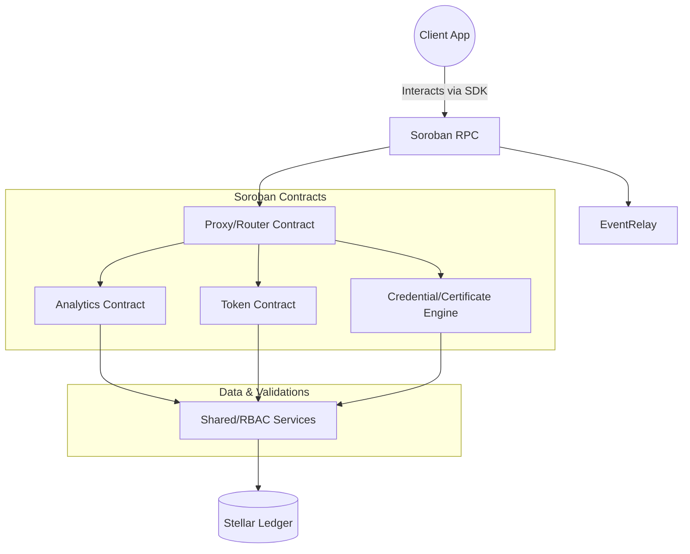

# System Architecture

The StarkMinds Smart Contracts system leverages the speed and efficiency of **Soroban on the Stellar network** to deliver a scalable, verifiable, and secure educational ecosystem.

## High-Level Design

The architecture follows a modular approach. Instead of one monolithic smart contract, responsibilities are cleanly divided into specialized scopes linked via a central coordination system (or client interfaces).

### Core Components

## System Interplay

1. **Proxy Paradigm:** 
   Contracts utilize a proxy implementation allowing bug fixes and upgrades without losing immutable state (such as user analytics and token balances). Upgrades are restricted via strict RBAC.
   
2. **Role-Based Access Control (RBAC):**
   The `Shared` contract holds state for all super-admins, standard admins, and external oracles. Before any critical state transition (like minting a credential or altering a reward rate), contracts query the `Shared` utility to guarantee authorization.

3. **Storage Strategy:**
   Soroban supports multiple storage models:
   - **Persistent Storage:** Used for mission-critical items like student credentials and token balances. This state survives long-term.
   - **Instance Storage:** Used for contract configurations (like minimum token thresholds, admin mappings).
   - **Temporary Storage:** Sometimes used during calculations or short-lived session interactions.

4. **Event Emission:**
   Every significant state change (e.g., `session_recorded`, `achievement_earned`, `credential_issued`) actively emits a Soroban event. Dashboards relying on StarkMinds use these events to map real-time performance to external databases or front-end caches efficiently without requiring constant on-chain RPC reads.

## Cross-Chain Operations

Certain credentials and achievements leverage multi-chain signatures via external oracles. Through our **Cross-Chain Framework**, credentials generated on Stellar can be verified on Ethereum by wrapping cryptographic proof objects securely. See the [Cross Chain Architecture](CROSS_CHAIN_ARCHITECTURE.md) document for an in-depth exploration.
