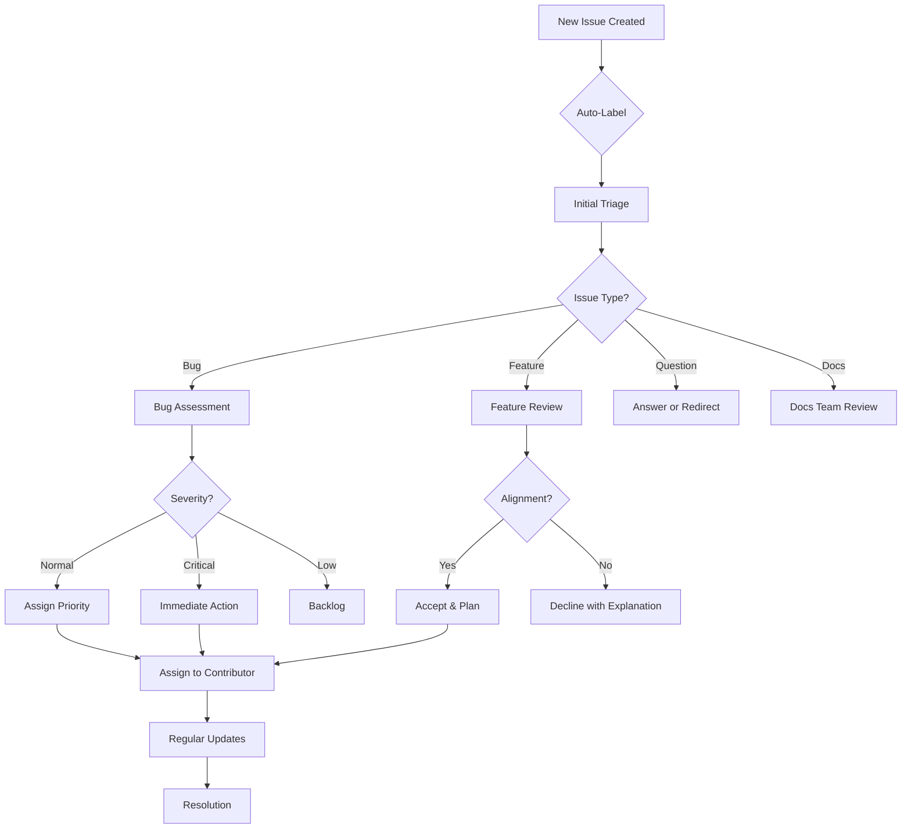
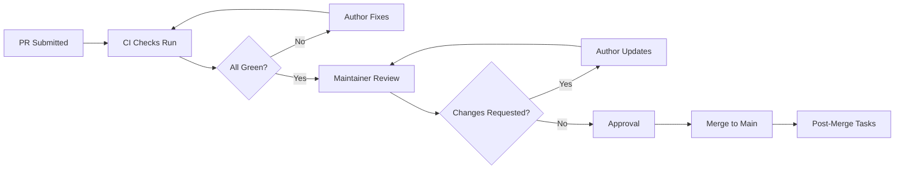

# Community Processes and Workflows

This document details the operational processes and workflows for community engagement, contribution management, and community health monitoring.

## Table of Contents

1. [Issue Management Process](#issue-management-process)
2. [Pull Request Workflow](#pull-request-workflow)
3. [Discussion Management](#discussion-management)
4. [Newcomer Onboarding](#newcomer-onboarding)
5. [Mentorship Program](#mentorship-program)
6. [Event Organization](#event-organization)
7. [Conflict Resolution Process](#conflict-resolution-process)
8. [Security Incident Response](#security-incident-response)
9. [Community Feedback Loop](#community-feedback-loop)
10. [Metrics and Reporting](#metrics-and-reporting)

## Issue Management Process

### Triage Workflow

### Issue Lifecycle Stages

#### Stage 1: Creation
**Automated Actions:**
- Welcome message posted
- Labels applied based on template
- Assignee suggested (if applicable)
- Notification sent to relevant team

**Expected Time**: Immediate

#### Stage 2: Initial Triage
**Actions by Maintainer:**
- Verify issue completeness
- Validate reproduction steps (for bugs)
- Assess security implications
- Apply appropriate labels
- Assign priority level

**Expected Time**: 24-48 hours

#### Stage 3: Assessment
**For Bugs:**
- Reproduce the issue
- Determine root cause
- Identify affected components
- Estimate fix complexity

**For Features:**
- Evaluate technical feasibility
- Assess alignment with roadmap
- Estimate implementation effort
- Identify dependencies

**Expected Time**: 3-5 days

#### Stage 4: Assignment
**Process:**
- Match issue to contributor skills/availability
- Consider newcomer-friendly issues for first-timers
- Confirm assignment with contributor
- Set expectations and timeline

**Expected Time**: 2-3 days after assessment

#### Stage 5: Implementation
**Contributor Responsibilities:**
- Regular progress updates (weekly minimum)
- Ask for help when blocked
- Follow coding standards
- Write tests
- Update documentation

**Maintainer Responsibilities:**
- Available for questions
- Review interim work if needed
- Remove blockers
- Provide guidance

**Expected Time**: Varies by complexity

#### Stage 6: Review & Closure
**Review Process:**
- Link to PR
- Automated CI checks
- Code review by maintainer
- Testing verification
- Documentation check

**Closure Criteria:**
- All tests passing
- Documentation updated
- Security review complete (if needed)
- Maintainer approval obtained

**Expected Time**: 5-7 days from PR submission

### Label System

#### Priority Labels
- `P0: Critical` - Drop everything, immediate attention
- `P1: High` - Important, next sprint
- `P2: Medium` - Normal priority, backlog
- `P3: Low` - Nice to have, when time permits

#### Status Labels
- `status: triage` - Needs initial review
- `status: accepted` - Approved to work on
- `status: in progress` - Currently being worked on
- `status: blocked` - Waiting on something
- `status: review` - Ready for review
- `status: merged` - Completed

#### Category Labels
- `type: bug` - Something isn't working
- `type: feature` - New functionality
- `type: enhancement` - Improvement to existing
- `type: documentation` - Docs improvement
- `type: question` - Need information
- `type: maintenance` - Chores and refactoring

#### Special Labels
- `good first issue` - Perfect for newcomers
- `help wanted` - Seeking contributors
- `security` - Security-related
- `breaking change` - Will break compatibility
- `needs discussion` - Requires community input

## Pull Request Workflow

### PR Submission Checklist

Before submitting a PR, contributors should verify:

- [ ] Issue is linked
- [ ] Code follows style guide
- [ ] Tests are added and passing
- [ ] Documentation is updated
- [ ] Security implications considered
- [ ] Commit messages are clear
- [ ] Changes are rebased on main
- [ ] No unnecessary files changed

### Review Process Flow

### Review Timeline

**Standard Timeline:**
- **Day 1**: Automated checks run
- **Day 2-3**: Initial maintainer review
- **Day 4-7**: Discussion and revisions
- **Day 7-10**: Final review and merge

**Expedited Timeline (for critical fixes):**
- Same day review
- 24-hour merge target

### Review Guidelines

#### For Reviewers

**Technical Review:**
- Code correctness
- Test coverage adequacy
- Performance implications
- Security considerations
- Backward compatibility

**Style Review:**
- Naming conventions
- Code organization
- Documentation quality
- Comment clarity

**Soft Skills:**
- Be constructive, not critical
- Explain reasoning
- Suggest alternatives
- Acknowledge good solutions
- Be patient with newcomers

#### For Authors

**Responsiveness:**
- Respond to feedback within 48 hours
- Ask clarifying questions
- Explain design decisions
- Accept constructive criticism

**Updates:**
- Push fixes promptly
- Keep PR focused
- Communicate delays
- Request re-review when ready

## Discussion Management

### Discussion Categories

#### Q&A
**Purpose**: Technical questions and answers  
**Moderation**: Light - community driven  
**Response Goal**: Within 72 hours

#### Ideas
**Purpose**: Feature proposals and improvements  
**Moderation**: Active - maintainer input needed  
**Response Goal**: Within 5 days

#### Show and Tell
**Purpose**: Share projects built with the contracts  
**Moderation**: Minimal - celebratory  
**Engagement**: Encourage community interaction

#### General
**Purpose**: Off-topic and community building  
**Moderation**: Light - keep civil  
**Tone**: Friendly and welcoming

### Discussion Best Practices

#### Starting Discussions

✅ **Do:**
- Use descriptive titles
- Provide context
- Stay on topic for category
- Be respectful
- Follow up on responses

❌ **Don't:**
- Cross-post same content
- Start arguments
- Spam or self-promote excessively
- Go off-topic repeatedly

#### Participating in Discussions

**Good Citizenship:**
- Upvote helpful contributions
- Mark answers as solutions
- Thank contributors
- Summarize long threads
- Report violations politely

## Newcomer Onboarding

### First-Time Contributor Journey

#### Step 1: Discovery (Days 1-2)
**Resources Provided:**
- README with quick start
- CONTRIBUTING.md guide
- CODE_OF_CONDUCT.md
- Good first issues list

**Actions:**
- Browse documentation
- Explore codebase
- Join community channels
- Introduce self

#### Step 2: Setup (Days 3-5)
**Resources Provided:**
- Development setup guide
- Environment configuration
- Test running instructions
- Sample projects

**Actions:**
- Install dependencies
- Build locally
- Run tests
- Fix simple issue or typo

#### Step 3: First Contribution (Days 5-14)
**Support Provided:**
- Assigned mentor/buddy
- Clear issue description
- Implementation guidance
- Patient code review

**Actions:**
- Claim good first issue
- Implement solution
- Submit PR
- Incorporate feedback
- Experience successful merge

#### Step 4: Integration (Days 14-30)
**Support Provided:**
- More complex issues
- Increased autonomy
- Community recognition
- Peer relationships

**Actions:**
- Take on medium difficulty issues
- Help other newcomers
- Participate in discussions
- Become regular contributor

### Onboarding Checklist for Maintainers

- [ ] Welcome message posted within 24 hours
- [ ] Good first issue suggested
- [ ] Mentor assigned if requested
- [ ] Setup questions answered promptly
- [ ] First PR reviewed with extra care
- [ ] Contribution celebrated publicly
- [ ] Path to further involvement clear

## Mentorship Program

### Program Structure

#### Mentor Roles

**Onboarding Buddy:**
- Helps with initial setup
- Answers basic questions
- Provides encouragement
- Time commitment: 2-4 weeks

**Technical Mentor:**
- Guides on complex tasks
- Reviews code thoroughly
- Teaches best practices
- Time commitment: 3-6 months

**Career Mentor:**
- Provides growth guidance
- Shares industry insights
- Makes connections
- Time commitment: 6-12 months

#### Mentee Expectations

**Active Participation:**
- Regular communication
- Prepared for meetings
- Following through on commitments
- Open to feedback

**Growth Mindset:**
- Willingness to learn
- Accepting constructive criticism
- Taking initiative
- Helping others in turn

### Matching Process

1. **Application**: Both parties fill out interest forms
2. **Matching**: Based on goals, availability, expertise
3. **Introduction**: Facilitated first meeting
4. **Goal Setting**: Define objectives together
5. **Regular Check-ins**: Monthly progress reviews
6. **Graduation**: Formal program completion
7. **Alumni**: Ongoing informal relationship

### Mentor Training

**Topics Covered:**
- Effective feedback techniques
- Growth mindset cultivation
- Inclusive mentoring
- Boundary setting
- Conflict navigation
- Resource sharing

## Event Organization

### Event Types and Requirements

#### Local Meetups

**Organizer Requirements:**
- Experienced community member
- Code of Conduct agreement
- Venue secured
- Minimum 10 attendees expected

**Project Support:**
- Presentation materials
- Speaker (if available)
- Promotional support
- Small swag pack
- Up to $100 venue support

**Timeline:**
- **8 weeks before**: Proposal submitted
- **6 weeks before**: Approval and date set
- **4 weeks before**: Promotion begins
- **2 weeks before**: Registration opens
- **1 week before**: Final details confirmed
- **Event day**: Execute and enjoy!
- **1 week after**: Retrospective and thanks

#### Workshops and Tutorials

**Format Options:**
- Half-day intensive (4 hours)
- Full-day deep dive (8 hours)
- Multi-session series

**Requirements:**
- Detailed curriculum
- Prerequisites defined
- Exercise materials prepared
- Setup instructions tested
- Helper TAs recruited

**Project Support:**
- Curriculum review
- Marketing assistance
- Platform access (if online)
- Certificate templates
- Recording equipment (budget permitting)

#### Conference Participation

**Support Levels:**

**Tier 1: Endorsement**
- Letter of support
- Logo usage permission
- Social media promotion

**Tier 2: Material Support**
- Presentation slides
- Demo materials
- Swag items

**Tier 3: Financial Support**
- Travel funding (partial)
- Registration fee
- Accommodation assistance

**Application Process:**
1. Submit proposal form
2. Review by maintainers (2 weeks)
3. Decision and support level determined
4. Coordination with organizers
5. Post-event report required

### Event Code of Conduct

All official events must:
- Display CoC prominently
- Have reporting mechanism
- Designate safe contact person
- Enforce consequences consistently
- Provide inclusive environment

## Conflict Resolution Process

### Informal Resolution

**Step 1: Direct Communication**
- Parties discuss issue directly
- Focus on behavior, not personality
- Seek mutual understanding
- Aim for agreed resolution

**Step 2: Facilitated Discussion**
- Neutral third party facilitates
- Each side shares perspective
- Identify common ground
- Brainstorm solutions

### Formal Process

**Step 3: Maintainer Intervention**
- Written complaint submitted
- Maintainer investigation
- Separate discussions with parties
- Proposed resolution

**Step 4: Community Input** (if needed)
- Anonymous survey
- Community discussion period
- Broader perspective gathering
- Consensus building

**Step 5: Final Decision**
- Maintainer decision made
- Rationale communicated
- Implementation plan
- Follow-up scheduled

### De-escalation Techniques

**During Conflicts:**
- Take breaks when heated
- Use private channels for sensitive topics
- Focus on project goals
- Remember shared values
- Assume good intentions

**After Resolution:**
- Check in with involved parties
- Monitor for recurrence
- Document lessons learned
- Update processes if needed

## Security Incident Response

### Incident Classification

#### Severity Levels

**Critical (P0):**
- Active exploit in progress
- Funds at immediate risk
- Private key compromise
- Critical vulnerability discovered

**High (P1):**
- Vulnerability with known workaround
- Potential fund loss scenario
- RBAC bypass possible
- Major functionality broken

**Medium (P2):**
- Non-critical bug
- Limited impact scope
- Workaround available
- Enhancement needed

**Low (P3):**
- Minor issue
- No security impact
- Cosmetic problems
- Documentation gaps

### Response Procedure

#### Critical Incidents

**Immediate Actions (First 4 hours):**
1. Acknowledge report
2. Assemble response team
3. Verify vulnerability
4. Assess impact scope
5. Prepare emergency fix

**Short-term (4-24 hours):**
1. Develop and test fix
2. Deploy to production
3. Notify affected users
4. Public disclosure (coordinated)
5. Post-mortem initiated

**Follow-up (1-7 days):**
1. Complete post-mortem
2. Implement preventive measures
3. Update security practices
4. Community report published

#### Standard Vulnerabilities

**Timeline:**
- **Day 1**: Acknowledge receipt
- **Week 1**: Verify and assess
- **Week 2**: Develop fix
- **Week 3**: Test and deploy
- **Week 4**: Public disclosure

### Disclosure Policy

**Private Disclosure:**
- Report to maintain only
- Keep confidential until fixed
- Coordinate public statement
- Credit reporter (if desired)

**Public Disclosure:**
- After fix deployed
- Include severity and impact
- Provide mitigation steps
- Thank security researchers

## Community Feedback Loop

### Feedback Collection Methods

#### Surveys
**Quarterly Community Survey:**
- Overall satisfaction
- Pain points identification
- Feature requests
- Demographic data (optional)
- Open-ended suggestions

**Event Feedback:**
- Post-event surveys
- Session ratings
- Speaker feedback
- Improvement suggestions

**Contribution Exit Interviews:**
- When contributors leave
- Understand reasons
- Gather improvement ideas
- Maintain positive relationships

#### Direct Channels
**Office Hours:**
- Weekly drop-in sessions
- Direct maintainer access
- Real-time feedback
- Issue resolution

**AMAs (Ask Me Anything):**
- Monthly sessions
- Maintainer panel
- Community questions
- Transparent answers

**Suggestion Box:**
- Always-open form
- Anonymous option
- Regular review
- Public responses

### Feedback Processing

#### Triage Process

1. **Collection**: All feedback gathered centrally
2. **Categorization**: Tagged by type and area
3. **Prioritization**: Ranked by impact and frequency
4. **Assignment**: Given to appropriate team
5. **Action**: Implemented or declined with reason
6. **Follow-up**: Reporter notified of outcome

#### Transparency

**Monthly Feedback Report:**
- Feedback received summary
- Actions taken
- Declined suggestions with rationale
- Trends identified
- Next steps

**Public Roadmap Updates:**
- Community-sourced features highlighted
- Progress on requested improvements
- Timeline adjustments based on feedback

## Metrics and Reporting

### Community Health Metrics

#### Activity Metrics

**Contributor Metrics:**
- Total contributors (monthly active)
- New contributors (first-time)
- Returning contributors
- Contributor retention rate
- Average contributions per contributor

**Contribution Metrics:**
- Issues opened/closed
- PRs submitted/merged
- Comments on issues/PRs
- Discussions started/replied
- Documentation edits

**Code Metrics:**
- Commits per week/month
- Lines added/removed
- Files changed
- Review turnaround time
- Merge rate

#### Quality Metrics

**Issue Metrics:**
- Time to first response
- Time to closure
- Reopen rate
- Bug vs feature ratio
- Backlog size and trend

**PR Metrics:**
- Time to first review
- Time to merge
- Revision count average
- CI pass rate
- Rollback rate

**Community Satisfaction:**
- Survey scores
- Net Promoter Score (NPS)
- Sentiment analysis
- Retention rates
- Growth rates

### Diversity & Inclusion Metrics

**Demographics** (voluntary self-reporting):
- Geographic distribution
- Experience levels
- Background diversity
- Gender representation (optional)
- Underrepresented groups participation

**Inclusion Indicators:**
- Newcomer retention rate
- Leadership diversity
- Speaking opportunity diversity
- Recognition program diversity
- Reported incidents and resolution

### Reporting Cadence

#### Weekly Reports (Automated)
- Activity summary
- Top contributors
- Issues/PRs closed
- Upcoming deadlines
- Alert conditions flagged

#### Monthly Reports (Manual + Automated)
- Comprehensive metrics dashboard
- Trend analysis
- Highlight reel
- Challenge areas
- Action items for maintainers

#### Quarterly Reports (Community-Wide)
- State of community address
- Strategic initiatives update
- Financial summary (if applicable)
- Recognition awards
- Forward-looking goals

### Dashboard Components

**Real-time Dashboard:**
- Current contributor count
- Active issues and PRs
- Recent activity feed
- Response time gauges
- Health score indicator

**Historical Trends:**
- Growth over time charts
- Seasonal pattern analysis
- Cohort retention curves
- Contribution distribution
- Sentiment trajectory

**Comparative Analysis:**
- Month-over-month changes
- Year-over-year growth
- Benchmark vs similar projects
- Goal progress tracking

---

## Continuous Improvement

### Process Review Cycle

**Monthly Maintainer Retrospective:**
- What processes worked well?
- What caused friction?
- What should we start/stop/continue?
- Action items for next month

**Quarterly Process Audit:**
- Review all documented processes
- Compare to industry best practices
- Identify automation opportunities
- Update documentation

**Annual Strategy Review:**
- Long-term community vision
- Strategic goal progress
- Major initiative planning
- Resource allocation

### Experimentation Framework

**Trying New Things:**
1. Propose experiment with clear hypothesis
2. Define success metrics upfront
3. Set time-boxed trial period
4. Gather data throughout
5. Evaluate results objectively
6. Decide: adopt, adapt, or abandon

**Examples of Experiments:**
- New meeting formats
- Different recognition methods
- Alternative contribution paths
- Novel onboarding approaches

### Knowledge Management

**Documentation Maintenance:**
- Owner assigned to each doc
- Review schedule (quarterly minimum)
- Version history maintained
- Obsolete content archived
- Translation efforts coordinated

**Lesson Learned Capture:**
- After major incidents
- Post-event retrospectives
- Project completions
- Contributor departures
- Process changes

**Best Practice Sharing:**
- Internal wiki/maintenance
- Cross-project collaboration
- Conference presentations
- Blog posts and articles
- Industry participation

---

**Version**: 1.0.0  
**Last Updated**: 2026-03-27  
**Owner**: Community Team  
**Review Cycle**: Quarterly  
**Next Review**: 2026-06-27
