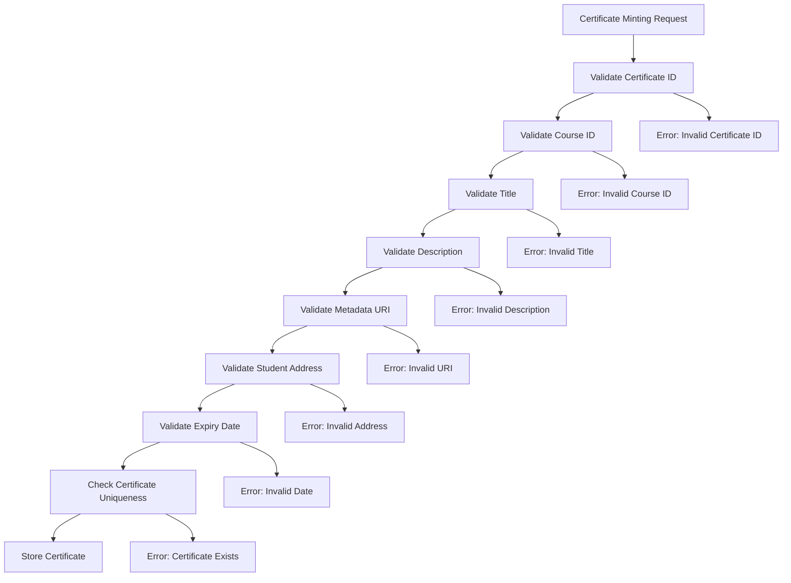

# Certificate Metadata Update Guide

## Overview

This guide describes the enhanced metadata validation and update processes for the certificate smart contract system. The implementation ensures data integrity, prevents malicious content injection, and provides comprehensive error handling for all certificate metadata operations.

## Table of Contents

1. [Validation Architecture](#validation-architecture)
2. [Metadata Fields Specification](#metadata-fields-specification)
3. [Update Flow Procedures](#update-flow-procedures)
4. [Validation Rules and Constraints](#validation-rules-and-constraints)
5. [Error Handling](#error-handling)
6. [Security Considerations](#security-considerations)
7. [Testing Guidelines](#testing-guidelines)
8. [API Reference](#api-reference)

## Validation Architecture

### Shared Validation Layer

The certificate system now uses a shared validation library (`contracts/shared/src/validation.rs`) that provides:

- **Reusable validation utilities** across all contract modules
- **Centralized configuration** for validation parameters
- **Consistent error reporting** with detailed messages
- **Standardized sanitization** functions

### Certificate-Specific Validation

Certificate-specific validation (`contracts/certificate/src/validation.rs`) extends the shared utilities with:

- **Certificate metadata validation** for minting and updates
- **Batch operation validation** for multiple certificates
- **Business logic validation** specific to educational certificates

## Metadata Fields Specification

### Core Fields

| Field | Type | Min Length | Max Length | Validation Rules |
|-------|------|------------|------------|------------------|
| `certificate_id` | BytesN<32> | 32 bytes | 32 bytes | Non-zero bytes required |
| `title` | String | 3 chars | 200 chars | No XSS chars, quality checks |
| `description` | String | 10 chars | 1000 chars | No XSS chars, quality checks |
| `course_id` | String | 3 chars | 100 chars | Alphanumeric + hyphens/underscores |
| `metadata_uri` | String | 10 chars | 500 chars | HTTPS/IPFS/Arweave only |
| `student` | Address | - | - | Valid Soroban address |
| `expiry_date` | u64 | - | - | Future date or 0 (non-expiring) |

### Validation Constants

```rust
pub struct ValidationConfig {
    // Size limits
    pub const MAX_TITLE_LENGTH: u32 = 200;
    pub const MAX_DESCRIPTION_LENGTH: u32 = 1000;
    pub const MAX_COURSE_ID_LENGTH: u32 = 100;
    pub const MAX_URI_LENGTH: u32 = 500;
    pub const MAX_BATCH_SIZE: u32 = 100;
    
    // Minimum lengths
    pub const MIN_TITLE_LENGTH: u32 = 3;
    pub const MIN_DESCRIPTION_LENGTH: u32 = 10;
    pub const MIN_COURSE_ID_LENGTH: u32 = 3;
    pub const MIN_URI_LENGTH: u32 = 10;
    
    // Security configurations
    pub const VALID_URI_SCHEMES: &'static [&'static str] = &["https://", "ipfs://", "ar://"];
    pub const MAX_SPECIAL_CHAR_RATIO: f32 = 0.3;
    pub const MAX_CONSECUTIVE_CHARS: usize = 5;
    pub const MAX_FUTURE_EXPIRY: u64 = 100 * 365 * 24 * 60 * 60; // 100 years
}
```

## Update Flow Procedures

### Certificate Minting Validation Flow



### Metadata Update Flow

```rust
// Example metadata update validation
pub fn update_certificate_metadata(
    env: Env,
    updater: Address,
    certificate_id: BytesN<32>,
    title: Option<String>,
    description: Option<String>,
    metadata_uri: Option<String>,
) -> Result<(), CertificateError> {
    // Authorization checks
    updater.require_auth();
    
    // Validate update permissions
    validate_update_permissions(&env, &updater, &certificate_id)?;
    
    // Validate new metadata fields
    MetadataValidator::validate_metadata_update(
        title.as_ref(),
        description.as_ref(),
        metadata_uri.as_ref(),
    )?;
    
    // Apply updates atomically
    apply_metadata_updates(&env, &certificate_id, title, description, metadata_uri)?;
    
    Ok(())
}
```

### Batch Operations

```rust
// Batch certificate minting with comprehensive validation
pub fn mint_certificates_batch(
    env: Env,
    issuer: Address,
    params_list: Vec<MintCertificateParams>,
) -> Result<(), CertificateError> {
    // Validate batch size and contents
    MetadataValidator::validate_batch_params(&env, &params_list.to_array())?;
    
    // Process each certificate
    for params in params_list.iter() {
        mint_certificate_internal(&env, &issuer, params)?;
    }
    
    Ok(())
}
```

## Validation Rules and Constraints

### XSS Prevention

**Forbidden Characters:**
- Script tags: `<`, `>`, `<script>`, `</script>`
- Event handlers: `onload`, `onerror`, `onclick`, etc.
- JavaScript protocols: `javascript:`
- HTML entities and encoded attacks
- Control characters (0x00-0x1F, 0x7F)
- Quotes: `"`, `'`
- Ampersand: `&`

**Example Rejected Inputs:**
```rust
// These will all be rejected
"<script>alert('xss')</script>"
"javascript:alert('xss')"
""
"';alert('xss');//"
"\"><script>alert('xss')</script>"
```

### Content Quality Rules

1. **Special Character Ratio**: Maximum 30% special characters
2. **Repetition Prevention**: Maximum 5 consecutive identical characters
3. **Whitespace Validation**: Cannot be whitespace-only
4. **Format Enforcement**: Alphanumeric + allowed separators for course IDs

### URI Security Rules

**Allowed Schemes:**
- `https://` - Secure web resources
- `ipfs://` - IPFS content addressing
- `ar://` - Arweave permanent storage

**URI Format Validation:**
- No spaces allowed in URI
- No consecutive slashes (`///`)
- Domain validation for HTTPS
- Hash format validation for IPFS
- Transaction ID validation for Arweave

**Example Valid URIs:**
```
https://university.edu/certificates/metadata.json
ipfs://QmYwAPJzv5CZsnA625s3Xf2nemtYgPpHdWEz79ojWnPbdG
ar://ABC123abc456XYZ789xyz012DEF345def678GHI
```

## Error Handling

### Enhanced Error Types

```rust
pub enum ValidationError {
    FieldTooShort { field: &'static str, min_length: u32, actual_length: usize },
    FieldTooLong { field: &'static str, max_length: u32, actual_length: usize },
    InvalidCharacters { field: &'static str, forbidden_char: char },
    InvalidFormat { field: &'static str, reason: &'static str },
    InvalidUri { reason: &'static str },
    InvalidDate { reason: &'static str },
    ContentQuality { reason: &'static str },
    EmptyField { field: &'static str },
}
```

### Certificate Error Mapping

```rust
// Validation errors are mapped to contract errors
pub enum CertificateError {
    InvalidMetadata = 12,     // General metadata issues
    InvalidUri = 13,          // URI-specific issues
    MetadataTooLarge = 14,    // Size constraint violations
    MetadataTooSmall = 15,    // Minimum size violations
    InvalidCharacters = 16,   // Forbidden character detection
    InvalidFormat = 17,       // Format validation failures
    // ... other errors
}
```

### Error Response Examples

```rust
// Detailed error information is available for debugging
match validation_result {
    Err(ValidationError::FieldTooShort { field, min_length, actual_length }) => {
        // Log: "Field 'title' is too short: 2 chars (minimum 3)"
        return Err(CertificateError::InvalidMetadata);
    },
    Err(ValidationError::InvalidCharacters { field, forbidden_char }) => {
        // Log: "Field 'description' contains forbidden character: '<'"
        return Err(CertificateError::InvalidCharacters);
    },
    // ... handle other errors
}
```

## Security Considerations

### Attack Prevention

1. **Cross-Site Scripting (XSS)**
   - Blocked malicious script injection
   - Comprehensive character filtering
   - Content sanitization without data loss

2. **Content Injection**
   - Prevented HTML/JavaScript insertion
   - Strict content type validation
   - Safe character encoding

3. **Buffer Overflow**
   - Size limits prevent excessive data storage
   - Early validation termination
   - Memory-safe operations

4. **Protocol Attacks**
   - Only secure URI schemes allowed
   - Comprehensive format validation
   - Domain and hash verification

### Data Integrity

- **Pre-storage Validation**: All metadata validated before storage
- **Consistent Format Enforcement**: Standardized validation rules
- **Atomic Operations**: Update operations are all-or-nothing
- **Audit Trail**: All validation failures are logged

### Performance Impact

- **Minimal Overhead**: O(n) complexity for string validation
- **Early Termination**: Validation stops on first failure
- **Batch Optimization**: Efficient validation for multiple certificates
- **Memory Efficiency**: Size limits prevent resource exhaustion

## Testing Guidelines

### Unit Test Categories

1. **Valid Input Acceptance**
   ```rust
   #[test]
   fn test_valid_certificate_data() {
       // Test all valid input combinations
   }
   ```

2. **Invalid Input Rejection**
   ```rust
   #[test]
   fn test_xss_prevention() {
       // Test XSS attack vectors
   }
   ```

3. **Boundary Condition Testing**
   ```rust
   #[test]
   fn test_length_boundaries() {
       // Test min/max length constraints
   }
   ```

4. **Edge Case Handling**
   ```rust
   #[test]
   fn test_edge_cases() {
       // Test unusual but valid inputs
   }
   ```

### Integration Test Requirements

1. **End-to-End Validation**: Test complete certificate lifecycle
2. **Batch Operation Testing**: Validate large batch operations
3. **Error Propagation**: Ensure errors are properly propagated
4. **Performance Testing**: Validate with maximum allowed inputs

### Test Coverage Requirements

- ✅ **Positive Cases**: All valid inputs accepted
- ✅ **Negative Cases**: All invalid inputs rejected
- ✅ **XSS Prevention**: All attack vectors blocked
- ✅ **Boundary Testing**: Min/max limits enforced
- ✅ **Format Validation**: URI and format rules enforced
- ✅ **Content Quality**: Quality checks functional
- ✅ **Batch Operations**: Large-scale operations validated
- ✅ **Error Handling**: Proper error reporting

## API Reference

### Core Validation Functions

#### `MetadataValidator::validate_mint_params`

Validates complete certificate minting parameters.

```rust
pub fn validate_mint_params(
    env: &Env, 
    params: &MintCertificateParams
) -> Result<(), CertificateError>
```

**Parameters:**
- `env`: Contract environment
- `params`: Certificate minting parameters

**Returns:**
- `Ok(())` if validation passes
- `CertificateError` with specific error type

#### `MetadataValidator::validate_metadata_update`

Validates partial metadata updates.

```rust
pub fn validate_metadata_update(
    title: Option<&String>,
    description: Option<&String>,
    metadata_uri: Option<&String>,
) -> Result<(), CertificateError>
```

**Parameters:**
- `title`: Optional new title
- `description`: Optional new description  
- `metadata_uri`: Optional new metadata URI

#### `MetadataValidator::validate_batch_params`

Validates batch certificate operations.

```rust
pub fn validate_batch_params(
    env: &Env, 
    params_list: &[MintCertificateParams]
) -> Result<(), CertificateError>
```

**Parameters:**
- `env`: Contract environment
- `params_list`: Array of certificate parameters

**Validation Includes:**
- Batch size limits (max 100)
- Individual certificate validation
- Duplicate ID detection

#### `MetadataValidator::sanitize_text`

Sanitizes text content for safe storage.

```rust
pub fn sanitize_text(text: &str) -> String
```

**Parameters:**
- `text`: Input text to sanitize

**Returns:**
- Sanitized text with forbidden characters removed

### Shared Validation Utilities

#### `CoreValidator::validate_text_field`

Validates text field with all checks.

```rust
pub fn validate_text_field(
    text: &str,
    field_name: &'static str,
    min_length: u32,
    max_length: u32,
) -> Result<(), ValidationError>
```

#### `CoreValidator::validate_uri`

Validates URI with all checks.

```rust
pub fn validate_uri(uri: &str) -> Result<(), ValidationError>
```

#### `CoreValidator::validate_course_id`

Validates course ID with all checks.

```rust
pub fn validate_course_id(course_id: &str) -> Result<(), ValidationError>
```

#### `CoreValidator::validate_expiry_date`

Validates expiry date constraints.

```rust
pub fn validate_expiry_date(
    env: &Env, 
    expiry_date: u64
) -> Result<(), ValidationError>
```

## Migration Guide

### Upgrading from Previous Versions

1. **Import Shared Validation**
   ```rust
   use shared::validation::{CoreValidator, ValidationConfig};
   ```

2. **Update Validation Calls**
   ```rust
   // Old way
   validate_title_length(&title)?;
   validate_title_format(&title)?;
   
   // New way
   CoreValidator::validate_text_field(
       &title,
       "title",
       ValidationConfig::MIN_TITLE_LENGTH,
       ValidationConfig::MAX_TITLE_LENGTH,
   )?;
   ```

3. **Enhanced Error Handling**
   ```rust
   // Map detailed errors to contract errors
   .map_err(|_| CertificateError::InvalidMetadata)
   ```

### Breaking Changes

- Stricter validation rules may reject previously accepted inputs
- Enhanced XSS prevention may filter more content
- New error types provide more specific error information
- Batch size limits are now enforced

### Backward Compatibility

- Existing valid certificates remain unaffected
- Core validation logic maintains same acceptance criteria
- API interfaces remain stable
- Error types are extended, not replaced

## Best Practices

### For Developers

1. **Always validate early** in the execution path
2. **Use shared validation utilities** for consistency
3. **Handle validation errors gracefully** with proper user feedback
4. **Test with attack vectors** during development
5. **Document validation requirements** in API documentation

### For Integrators

1. **Validate client-side** before contract calls
2. **Handle specific error types** for better UX
3. **Implement retry logic** for transient failures
4. **Cache validation results** when appropriate
5. **Monitor validation failures** for security insights

### For Security Auditors

1. **Review validation coverage** for all input paths
2. **Test XSS prevention** with comprehensive attack vectors
3. **Verify error handling** doesn't leak sensitive information
4. **Check batch operation limits** for DoS prevention
5. **Validate URI security** for all supported schemes

## Conclusion

The enhanced metadata validation system provides comprehensive protection against malicious content while maintaining usability and performance. The shared validation architecture ensures consistency across all contract modules while providing detailed error reporting for debugging and security monitoring.

For questions or issues related to metadata validation, please refer to the test suites in `contracts/certificate/src/` for comprehensive examples of proper usage and edge case handling.