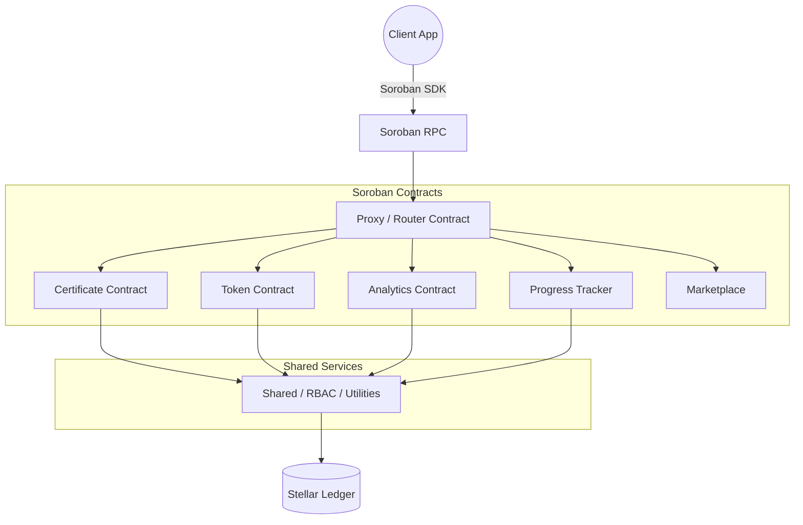

# Smart Contract Development Guide

> StrellerMinds Smart Contracts — built on [Soroban](https://soroban.stellar.org/) (Stellar's WASM contract runtime).

---

## Table of Contents

1. [Setup Guide](#1-setup-guide)
2. [Architecture Overview](#2-architecture-overview)
3. [Contract Development](#3-contract-development)
4. [Testing Best Practices](#4-testing-best-practices)
5. [Security Checklist](#5-security-checklist)

---

## 1. Setup Guide

### Prerequisites

| Tool | Version | Install |
|------|---------|---------|
| Rust | stable (see `rust-toolchain.toml`) | `curl --proto '=https' --tlsv1.2 -sSf https://sh.rustup.rs \| sh` |
| Soroban CLI | 21.5.0 | `cargo install --locked soroban-cli --version 21.5.0` |
| Docker | Latest | [docker.com](https://docker.com) — required for E2E / localnet |
| wasm32 target | — | `rustup target add wasm32-unknown-unknown` |

### Clone and Verify

```bash
git clone https://github.com/StarkMindsHQ/StrellerMinds-SmartContracts.git
cd StrellerMinds-SmartContracts

# Verify prerequisites
make check

# Build all contracts
make build
```

### Environment Variables

```bash
# Testnet deployment
export STELLAR_SECRET_KEY="S..."   # Your funded Stellar secret key

# Optional: point at a custom RPC
export SOROBAN_RPC_URL="https://soroban-testnet.stellar.org"
export SOROBAN_NETWORK_PASSPHRASE="Test SDF Network ; September 2015"
```

### Quick Start

```bash
make help          # list all targets
make build         # compile all contracts to WASM
make unit-test     # fast unit tests (no Docker required)
make test          # unit + E2E tests (requires Docker)
make check-code    # format + strict lint — run before every PR
```

---

## 2. Architecture Overview

The system follows a **modular, multi-contract** design on Stellar/Soroban. No single monolith — each domain owns its state and logic.



### Core Contracts

| Contract | Path | Responsibility |
|----------|------|---------------|
| `shared` | `contracts/shared/` | RBAC, rate limiting, reentrancy guard, logging, monitoring |
| `certificate` | `contracts/certificate/` | Issue, revoke, multi-sig approve, and share certificates |
| `token` | `contracts/token/` | Mint, transfer, and balance tracking for the platform token |
| `analytics` | `contracts/analytics/` | Record learning sessions and aggregate metrics |
| `progress` | `contracts/progress/` | Track student course progress milestones |
| `marketplace` | `contracts/marketplace/` | Peer-to-peer course and credential marketplace |
| `proxy` | `contracts/proxy/` | Upgradeable proxy — preserves state across contract upgrades |

### Key Design Patterns

**Proxy / Upgradeability**  
All user-facing contracts sit behind a proxy. Upgrades change implementation WASM without migrating persistent storage. Only SuperAdmin can trigger upgrades.

**Role-Based Access Control (RBAC)**  
The `shared` contract is the single source of truth for roles. Every sensitive entry point calls into `shared` to verify caller permissions before mutating state.

```
SuperAdmin > Admin > Oracle > User
```

**Storage Tiers**

| Tier | Soroban API | Use |
|------|------------|-----|
| Persistent | `env.storage().persistent()` | Student credentials, token balances — survives ledger TTL |
| Instance | `env.storage().instance()` | Contract config, admin address — scoped to contract lifetime |
| Temporary | `env.storage().temporary()` | Short-lived session data, in-flight calculation state |

**Event Emission**  
Every state-changing operation emits a typed Soroban event. Off-chain indexers consume these events; never rely on polling on-chain storage for dashboards.

---

## 3. Contract Development

### Project Layout

```
contracts/
├── shared/          # Shared utilities (import in every contract)
│   └── src/
│       ├── roles.rs
│       ├── permissions.rs
│       ├── rate_limiter.rs
│       ├── reentrancy_guard.rs
│       ├── logger.rs
│       └── ...
├── certificate/
│   └── src/
│       ├── lib.rs       # Contract entry points
│       ├── types.rs     # contracttype definitions
│       ├── storage.rs   # Storage key helpers
│       ├── errors.rs    # Error enum
│       ├── events.rs    # Event definitions
│       └── test.rs      # Unit tests
└── token/
    └── src/
        ├── lib.rs
        ├── types.rs
        ├── incentives.rs
        └── test.rs
```

### Creating a New Contract

1. Add the contract directory under `contracts/`:

```bash
mkdir -p contracts/my-contract/src
```

2. Create `contracts/my-contract/Cargo.toml` — always inherit workspace deps:

```toml
[package]
name = "my-contract"
version = "0.1.0"
edition = "2021"

[lib]
crate-type = ["cdylib", "rlib"]

[dependencies]
soroban-sdk = { workspace = true }
shared = { workspace = true }

[dev-dependencies]
soroban-sdk = { workspace = true, features = ["testutils"] }
```

3. Add the crate to workspace `Cargo.toml`:

```toml
[workspace]
members = ["contracts/*", "e2e-tests", "utils/streller-cli"]
```

4. Implement the contract entry point in `src/lib.rs`:

```rust
#![no_std]

mod errors;
mod storage;
mod types;

use errors::MyError;
use shared::rate_limiter::{enforce_rate_limit, RateLimitConfig};
use shared::{log_info};
use soroban_sdk::{contract, contractimpl, Address, Env};

#[contract]
pub struct MyContract;

#[contractimpl]
impl MyContract {
    pub fn initialize(env: Env, admin: Address) -> Result<(), MyError> {
        admin.require_auth();
        if storage::is_initialized(&env) {
            return Err(MyError::AlreadyInitialized);
        }
        storage::set_admin(&env, &admin);
        log_info!(env, "my-contract", "initialized");
        Ok(())
    }

    pub fn do_something(env: Env, caller: Address) -> Result<(), MyError> {
        caller.require_auth();
        require_initialized(&env)?;
        require_admin(&env, &caller)?;
        // ... logic
        Ok(())
    }
}

fn require_admin(env: &Env, caller: &Address) -> Result<(), MyError> {
    let admin = storage::get_admin(env);
    if *caller != admin {
        return Err(MyError::Unauthorized);
    }
    Ok(())
}

fn require_initialized(env: &Env) -> Result<(), MyError> {
    if !storage::is_initialized(env) {
        return Err(MyError::NotInitialized);
    }
    Ok(())
}
```

### Using Shared Utilities

**RBAC check:**

```rust
use shared::roles::Role;
use shared::permissions::Permission;

// Verify caller has at least Admin role
shared::access_control::require_role(&env, &caller, Role::Admin)?;

// Verify specific permission
shared::access_control::require_permission(&env, &caller, Permission::MintCertificate)?;
```

**Rate limiting:**

```rust
use shared::rate_limiter::{enforce_rate_limit, RateLimitConfig};

const RL_OP_MINT: u64 = 1;

let config = RateLimitConfig {
    max_calls: 10,
    window_seconds: 3_600,
};
enforce_rate_limit(&env, &caller, RL_OP_MINT, &config)?;
```

**Reentrancy guard:**

```rust
use shared::reentrancy_guard::ReentrancyGuard;

let _guard = ReentrancyGuard::enter(&env)?; // panics if already entered
// ... state mutation
// guard dropped at end of scope
```

**Structured logging:**

```rust
use shared::{log_info, log_warn, log_error};

log_info!(env, "certificate", "issued cert for student");
log_warn!(env, "token", "transfer rate limit approaching");
log_error!(env, "marketplace", "unauthorized listing attempt");
```

**Emitting events:**

```rust
use shared::event_schema::TokensMintedEvent;
use shared::emit_token_event;

emit_token_event!(env, TokensMintedEvent {
    recipient: recipient.clone(),
    amount,
});
```

### Storage Conventions

Keep all storage key definitions and accessors in a dedicated `storage.rs`:

```rust
use soroban_sdk::{Env, Address, Symbol, symbol_short};
use soroban_sdk::contracttype;

#[contracttype]
enum DataKey {
    Admin,
    Initialized,
    Record(Address),
}

pub fn set_admin(env: &Env, admin: &Address) {
    env.storage().instance().set(&DataKey::Admin, admin);
}

pub fn get_admin(env: &Env) -> Address {
    env.storage().instance().get(&DataKey::Admin).unwrap()
}

pub fn is_initialized(env: &Env) -> bool {
    env.storage().instance().has(&DataKey::Initialized)
}
```

**Rules:**
- Use `persistent()` for user data that must survive ledger TTL bumps.
- Use `instance()` for contract-level config (admin, feature flags).
- Never use `temporary()` for data that must be readable after the current transaction.
- Bump TTL on persistent keys that get read, not just written.

### Multi-Sig Certificate Pattern

The certificate contract implements a two-phase multi-sig flow:

```
create_multisig_request() → [approvers sign] → execute_certificate()
```

```rust
// Phase 1: create request
let request_id = certificate_client.create_multisig_request(
    &env,
    &course_id,
    &student,
    &metadata,
);

// Phase 2: each approver signs
certificate_client.approve_multisig_request(&env, &approver, &request_id);

// Auto-execute fires when threshold met (if auto_execute = true)
// or call manually:
certificate_client.execute_multisig_certificate(&env, &admin, &request_id);
```

Priority tiers control required approvals:

| Priority | Required Approvals |
|----------|-------------------|
| Standard | 1 |
| Premium | 2 |
| Enterprise | 3 |
| Institutional | 5 |

---

## 4. Testing Best Practices

### Unit Tests

Put unit tests in `src/test.rs` (or inline with `#[cfg(test)]`). Use Soroban's `testutils` feature for in-process test environments — no Docker needed.

```rust
#[cfg(test)]
mod test {
    use super::*;
    use soroban_sdk::testutils::{Address as _, AuthorizedFunction, Ledger};
    use soroban_sdk::{Address, Env};

    fn setup() -> (Env, Address, MyContractClient) {
        let env = Env::default();
        env.mock_all_auths();
        let admin = Address::generate(&env);
        let contract_id = env.register_contract(None, MyContract);
        let client = MyContractClient::new(&env, &contract_id);
        client.initialize(&admin);
        (env, admin, client)
    }

    #[test]
    fn test_happy_path() {
        let (env, admin, client) = setup();
        // assert expected state
        assert_eq!(client.get_admin(), admin);
    }

    #[test]
    fn test_unauthorized_rejected() {
        let (env, _, client) = setup();
        let attacker = Address::generate(&env);
        let result = client.try_do_something(&attacker);
        assert!(result.is_err());
    }
}
```

**Rules:**
- Every public entry point needs at least one happy-path test and one unauthorized test.
- Test error variants explicitly — `try_foo()` returns `Result`, use it.
- Advance ledger time with `env.ledger().set_timestamp(ts)` to test TTL and timeout logic.
- Mock auth with `env.mock_all_auths()` in tests, never bypass auth in production code.

### Property-Based Tests

Use `proptest` for data-driven invariant checking:

```rust
use proptest::prelude::*;

proptest! {
    #[test]
    fn token_transfer_never_overflows(amount in 0u128..u128::MAX/2) {
        let (env, admin, client) = setup();
        let user = Address::generate(&env);
        client.mint(&admin, &user, &(amount as i128));
        let balance = client.balance(&user);
        prop_assert_eq!(balance, amount as i128);
    }
}
```

### End-to-End Tests

E2E tests deploy real WASM to Soroban localnet via Docker:

```bash
# Start localnet
make localnet-start

# Run all E2E tests
make e2e-test

# Run a specific test
./scripts/run_e2e_tests.sh --filter "certificate"

# Keep localnet for debugging
make e2e-test-keep

# Stop localnet
make localnet-stop
```

Test accounts available in localnet:

| Account | Role |
|---------|------|
| `admin` | SuperAdmin |
| `alice` | Instructor / Student |
| `bob` | Student |
| `charlie` | Student |

### Gas Regression Tests

Run before merging any change that touches hot paths:

```bash
cargo test gas_regression
```

Track gas budgets per operation and fail if they regress beyond threshold. See [gas_optimization_analysis.md](gas_optimization_analysis.md) for current baselines.

### Performance Benchmarks

```bash
# Run benchmarks and produce report
./scripts/perf_profile.sh --report target/perf_report.json

# Save new baseline
./scripts/perf_profile.sh --baseline

# Compare against saved baseline
./scripts/perf_profile.sh --compare target/perf_baseline.json
```

### Coverage

```bash
# Generate coverage report (llvm-cov)
cargo llvm-cov --workspace --html --output-dir target/coverage

# Open report
open target/coverage/index.html
```

Target: **≥ 80% line coverage** on all `contracts/` crates.

---

## 5. Security Checklist

Run through this list before every PR that touches contract logic.

### Access Control

- [ ] Every entry point calls `caller.require_auth()` before reading `caller`
- [ ] Admin-only operations call `require_admin()` or the RBAC equivalent
- [ ] Role hierarchy is respected — lower roles cannot grant higher roles
- [ ] No entry point allows self-role-revocation that would lock out all admins
- [ ] Proxy upgrades are gated on `SuperAdmin` role only

### Input Validation

- [ ] All `Address` parameters are validated (non-zero, correct format)
- [ ] Numeric inputs have explicit bounds checks (no silent overflow)
- [ ] String / `Bytes` inputs have length caps
- [ ] Batch operations cap size (see `MAX_BATCH_SIZE = 100` in certificate contract)
- [ ] No user-supplied data is passed to `env.invoke_contract` without sanitization

### Reentrancy

- [ ] Any function that calls an external contract uses `ReentrancyGuard`
- [ ] State writes happen **before** external calls, not after
- [ ] No recursive call path exists that can re-enter the same function

### Rate Limiting

- [ ] High-frequency entry points (mint, transfer, request) use `enforce_rate_limit`
- [ ] Rate limit configs are stored in `instance()` storage so they can be updated by admin
- [ ] Default limits are conservative — tighten per production load data

### Storage Safety

- [ ] Persistent keys have TTL bumps on read to prevent premature expiry
- [ ] No uninitialized storage reads without a `.unwrap_or_default()` or explicit check
- [ ] Storage keys use typed `#[contracttype]` enums, not raw symbols, to prevent collisions

### Multi-Sig Safety

- [ ] Multi-sig requests have a `timeout_duration` (min 1 hour, max 30 days)
- [ ] Approver list is validated at config time: no duplicates, length ≤ `MAX_APPROVERS = 10`
- [ ] Executed and expired requests cannot be re-approved
- [ ] `auto_execute` flag is reviewed — consider disabling for high-value certificates

### Events

- [ ] Every state mutation emits at least one event
- [ ] Events include enough data for off-chain indexers to reconstruct state without querying storage
- [ ] No sensitive data (private keys, PII) is emitted in events

### Upgrade Safety

- [ ] New storage keys are additive — never reuse old keys with different types
- [ ] Migration functions are idempotent — safe to call multiple times
- [ ] Upgrade is tested in a forked localnet environment before mainnet

### Pre-PR Commands

```bash
# Format
cargo fmt --all

# Strict lint (must pass clean)
cargo clippy --workspace --all-targets --all-features -- -D warnings -D nonstandard-style

# Security advisory scan
cargo audit

# Dependency policy check
cargo deny check

# All tests
make test
```

---

## Additional Resources

- [Architecture Overview](ARCHITECTURE.md)
- [API Reference](API.md)
- [Security Audit Report](SECURITY_AUDIT_REPORT.md)
- [Security Testing Guide](SECURITY_TESTING.md)
- [Gas Optimization Guidelines](GAS_OPTIMIZATION_GUIDELINES.md)
- [Deployment Guide](DEPLOYMENT.md)
- [Cross-Chain Architecture](CROSS_CHAIN_ARCHITECTURE.md)
- [Reentrancy Protection](REENTRANCY_PROTECTION.md)
- [Upgradeable Contracts](UPGRADEABLE_CONTRACTS.md)
- [Contributing Guide](contributing.md)
