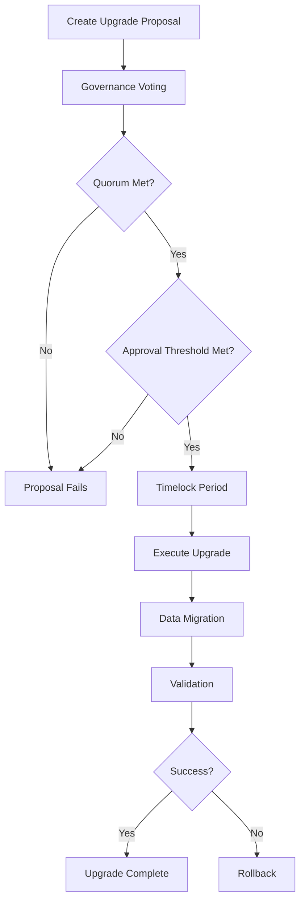
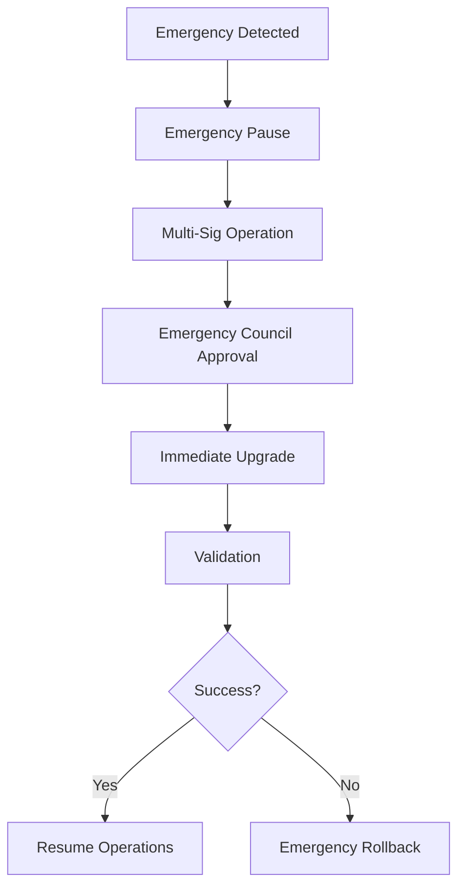

# Upgradeable Contract Architecture Guide

## Overview

This document provides a comprehensive guide to the upgradeable contract architecture implemented in the StrellerMinds Smart Contracts system. The architecture enables safe, secure, and governed contract upgrades while maintaining data integrity and providing rollback capabilities.

## Architecture Components

### 1. Upgradeable Proxy Contract

The `UpgradeableProxy` contract serves as the main entry point and manages contract upgrades while preserving the contract address and state.

#### Key Features:
- **Admin Control**: Designated admin addresses can initiate and execute upgrades
- **Version Management**: Tracks contract versions and upgrade history
- **Emergency Controls**: Pause/resume functionality for emergency situations
- **Timelock Protection**: Configurable delay between upgrade proposal and execution
- **Rollback Support**: Automatic backup creation for emergency rollbacks

#### Core Functions:
```rust
// Initialize proxy with admin and implementation
initialize(env, admin, implementation, version)

// Propose upgrade with timelock
propose_upgrade(env, admin, new_implementation, version, timelock, requires_migration, migration_plan)

// Execute upgrade after timelock
execute_upgrade(env, admin)

// Emergency rollback
rollback(env, admin)

// Emergency controls
emergency_pause(env, admin)
emergency_resume(env, admin)
```

### 2. Data Migration System

The `DataMigration` module provides comprehensive data transformation capabilities during upgrades.

#### Migration Operations:
- **Transform**: Convert data from old schema to new schema
- **Copy**: Duplicate data to new location
- **Move**: Transfer data and remove from original location
- **Delete**: Clean up obsolete data
- **Validate**: Verify data integrity

#### Migration Process:
1. **Plan Creation**: Define migration steps and requirements
2. **Backup Creation**: Automatic backup of current state
3. **Step Execution**: Execute migration steps with retry logic
4. **Validation**: Verify data integrity after migration
5. **Cleanup**: Remove temporary data and backup after successful migration

### 3. Governance System

The `UpgradeGovernance` module provides decentralized decision-making for contract upgrades.

#### Governance Features:
- **Proposal System**: Structured upgrade proposals with detailed descriptions
- **Voting Mechanism**: Token-weighted or address-weighted voting
- **Quorum Requirements**: Minimum participation thresholds
- **Multi-signature Support**: Critical operations require multiple signatures
- **Emergency Council**: Special powers for emergency situations

#### Governance Flow:
1. **Proposal Creation**: Any governance member can create upgrade proposals
2. **Voting Period**: Configurable voting window with transparent vote recording
3. **Approval Check**: Automatic validation of quorum and approval thresholds
4. **Execution Delay**: Additional security delay before execution
5. **Execution**: Approved upgrades can be executed by any governance member

## Upgrade Process Workflow

### Standard Upgrade Process



### Emergency Upgrade Process



## Implementation Guide

### 1. Setting Up an Upgradeable Contract

```rust
use soroban_sdk::{Address, Env};
use crate::proxy::{UpgradeableProxy, VersionInfo};

// Initialize the proxy contract
let admin = Address::generate(&env);
let implementation = Address::generate(&env);
let version = VersionInfo::new(1, 0, 0, implementation.clone(), env.ledger().timestamp());

UpgradeableProxy::initialize(env.clone(), admin, implementation, version)?;
```

### 2. Creating an Upgrade Proposal

```rust
// Create governance proposal
let proposal_id = UpgradeGovernance::create_proposal(
    &env,
    proposer,
    new_implementation,
    String::from_str(&env, "1.1.0"),
    String::from_str(&env, "Add new features and fix bugs"),
    86400, // 24 hour voting period
    metadata,
)?;

// Vote on proposal
UpgradeGovernance::vote(
    &env,
    voter,
    proposal_id,
    true, // Vote for
    String::from_str(&env, "This upgrade improves security"),
)?;
```

### 3. Executing an Upgrade

```rust
// After voting period and approval
let new_impl = UpgradeGovernance::execute_proposal(&env, executor, proposal_id)?;

// Execute the actual upgrade
UpgradeableProxy::execute_upgrade(env.clone(), admin)?;
```

### 4. Data Migration

```rust
// Create migration plan
let migration_id = Symbol::new(&env, "v1_to_v1_1");
let steps = vec![
    MigrationStep {
        operation: MigrationOperation::Transform {
            old_key: Symbol::new(&env, "old_data"),
            new_key: Symbol::new(&env, "new_data"),
            transform_fn: Symbol::new(&env, "transform_v1_to_v1_1"),
        },
        description: String::from_str(&env, "Transform user data format"),
        required: true,
        retry_count: 0,
        max_retries: 3,
    },
];

DataMigration::create_migration_plan(
    &env,
    migration_id,
    String::from_str(&env, "1.0.0"),
    String::from_str(&env, "1.1.0"),
    steps,
    3600, // Estimated duration
);

// Execute migration
let migrated_items = DataMigration::execute_migration(&env, migration_id)?;
```

## Security Considerations

### 1. Access Control

- **Admin Rights**: Only designated admin addresses can initiate upgrades
- **Governance Rights**: Only governance members can vote on proposals
- **Emergency Council**: Limited set of addresses with emergency powers
- **Multi-signature**: Critical operations require multiple approvals

### 2. Timelock Protection

- **Upgrade Timelock**: Configurable delay between proposal and execution
- **Execution Delay**: Additional delay after approval before execution
- **Emergency Override**: Multi-sig can bypass timelocks in emergencies

### 3. Data Integrity

- **Automatic Backups**: Created before every upgrade
- **Migration Validation**: Data integrity checks after migration
- **Rollback Capability**: Ability to restore previous state
- **Checksum Verification**: Verify data integrity during rollback

### 4. Governance Security

- **Quorum Requirements**: Prevent small groups from making decisions
- **Approval Thresholds**: Ensure broad consensus for upgrades
- **Transparent Voting**: All votes recorded and publicly visible
- **Proposal Expiration**: Prevent stale proposals from being executed

## Best Practices

### 1. Upgrade Planning

1. **Comprehensive Testing**: Test upgrades extensively on testnet
2. **Migration Planning**: Plan data migrations carefully with rollback options
3. **Security Review**: Conduct security audits of new implementations
4. **Documentation**: Document all changes and migration procedures
5. **Communication**: Inform users about upcoming upgrades and changes

### 2. Version Management

1. **Semantic Versioning**: Use semantic versioning (major.minor.patch)
2. **Compatibility**: Maintain backward compatibility when possible
3. **Version History**: Keep detailed version history and changelogs
4. **Deprecation Notices**: Provide advance notice of breaking changes

### 3. Governance

1. **Clear Proposals**: Provide detailed upgrade proposals with clear descriptions
2. **Adequate Voting Periods**: Allow sufficient time for consideration
3. **Community Engagement**: Encourage community participation in governance
4. **Transparency**: Make all governance decisions and votes transparent

### 4. Emergency Procedures

1. **Emergency Response Plan**: Have clear procedures for emergency situations
2. **Multi-sig Setup**: Ensure emergency council is properly configured
3. **Communication Channels**: Establish clear communication channels for emergencies
4. **Testing**: Regularly test emergency procedures

## Configuration Examples

### Basic Governance Configuration

```rust
let config = GovernanceConfig {
    min_voting_period: 86400,      // 1 day minimum
    max_voting_period: 604800,     // 1 week maximum
    quorum_percentage: 50,          // 50% participation required
    approval_percentage: 66,         // 66% approval required
    execution_delay: 86400,         // 1 day delay before execution
    governance_addresses: vec![admin, council1, council2],
    multi_sig_threshold: 3,         // 3 signatures for emergency operations
};
```

### Advanced Migration Plan

```rust
let complex_migration = MigrationPlan {
    migration_id: Symbol::new(&env, "major_upgrade"),
    from_version: String::from_str(&env, "1.0.0"),
    to_version: String::from_str(&env, "2.0.0"),
    steps: vec![
        // Backup critical data
        MigrationStep {
            operation: MigrationOperation::Copy {
                source_key: Symbol::new(&env, "user_data"),
                target_key: Symbol::new(&env, "user_data_backup"),
            },
            description: String::from_str(&env, "Backup user data"),
            required: true,
            retry_count: 0,
            max_retries: 5,
        },
        // Transform data structure
        MigrationStep {
            operation: MigrationOperation::Transform {
                old_key: Symbol::new(&env, "user_data"),
                new_key: Symbol::new(&env, "user_data_v2"),
                transform_fn: Symbol::new(&env, "migrate_user_data"),
            },
            description: String::from_str(&env, "Migrate user data to v2 format"),
            required: true,
            retry_count: 0,
            max_retries: 3,
        },
        // Validate migration
        MigrationStep {
            operation: MigrationOperation::Validate {
                key: Symbol::new(&env, "user_data_v2"),
                validation_fn: Symbol::new(&env, "validate_user_data"),
            },
            description: String::from_str(&env, "Validate migrated data"),
            required: true,
            retry_count: 0,
            max_retries: 3,
        },
        // Cleanup old data
        MigrationStep {
            operation: MigrationOperation::Delete {
                key: Symbol::new(&env, "user_data"),
            },
            description: String::from_str(&env, "Remove old user data"),
            required: false, // Optional cleanup
            retry_count: 0,
            max_retries: 1,
        },
    ],
    created_at: env.ledger().timestamp(),
    estimated_duration: 7200, // 2 hours
    rollback_available: true,
};
```

## Troubleshooting

### Common Issues and Solutions

1. **Upgrade Fails During Migration**
   - Check migration step configurations
   - Verify data compatibility
   - Review error logs for specific failure points
   - Consider rollback and retry with updated migration plan

2. **Governance Vote Fails**
   - Verify voter eligibility
   - Check voting period timing
   - Ensure quorum and approval thresholds are met
   - Review proposal details for completeness

3. **Emergency Rollback Issues**
   - Verify rollback data availability
   - Check rollback window (typically 7 days)
   - Ensure proper multi-sig authorization
   - Validate data integrity before and after rollback

4. **Timelock Delays**
   - Plan upgrades well in advance
   - Use emergency procedures only when necessary
   - Consider shorter timelocks for non-critical upgrades
   - Document timelock periods clearly in proposals

## Monitoring and Maintenance

### Key Metrics to Monitor

1. **Upgrade Success Rate**: Track success/failure rates of upgrades
2. **Migration Duration**: Monitor time taken for data migrations
3. **Governance Participation**: Track voting participation rates
4. **Emergency Events**: Monitor frequency of emergency procedures

### Regular Maintenance Tasks

1. **Backup Verification**: Regularly verify backup integrity
2. **Configuration Review**: Periodically review governance configurations
3. **Security Audits**: Conduct regular security audits of upgrade mechanisms
4. **Documentation Updates**: Keep documentation current with system changes

## Conclusion

The upgradeable contract architecture provides a robust, secure, and governed framework for managing contract upgrades. By following the best practices and security considerations outlined in this guide, you can ensure safe and reliable contract upgrades while maintaining system integrity and user trust.

For specific implementation details, refer to the individual module documentation and test cases provided in the codebase.
