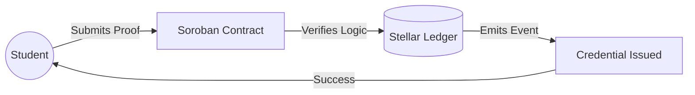

# StarkMinds Smart Contracts

Welcome to the official documentation for the StarkMinds smart contracts, built on the Stellar network using Soroban.

## 🏗️ System Architecture
This diagram shows the flow of course validation and credential issuance.

## 🚀 Getting Started
- Development workflow: [development.md](development.md)
- Developer tools and CLI: [developer-tools.md](developer-tools.md)
- Contributor onboarding and workshops: [developer-training.md](developer-training.md)

## 🤝 Community
- Community guidelines: [COMMUNITY_GUIDELINES.md](../COMMUNITY_GUIDELINES.md)
- Contributing: [CONTRIBUTING.md](../CONTRIBUTING.md)
- Code of conduct: [CODE_OF_CONDUCT.md](../CODE_OF_CONDUCT.md)
- Governance and triage: [GOVERNANCE.md](../.github/GOVERNANCE.md)

## 🔐 Security and Quality
- Security overview: [security.md](security.md)
- Security testing: [SECURITY_TESTING.md](SECURITY_TESTING.md)
- Code style: [CODE_STYLE.md](CODE_STYLE.md)

## 📦 Releases and Upgrades
- Release management: [RELEASE_MANAGEMENT.md](RELEASE_MANAGEMENT.md)
- Release process: [RELEASE_PROCESS.md](RELEASE_PROCESS.md)
- Upgrade framework: [UPGRADE_FRAMEWORK.md](UPGRADE_FRAMEWORK.md)

## 🔧 Reliability & Incident Handling
- [Circuit Breaker Operations Runbook](./CIRCUIT_BREAKER_RUNBOOK.md)

## 📈 Effectiveness
- Tool and training effectiveness: [tool-effectiveness-review.md](tool-effectiveness-review.md)
